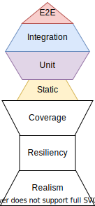

If you have been reading about test driven development in Javascript, chances
are you have come across [Kent C. Dodds](https://kentcdodds.com/), the
[Testing Trophy](https://twitter.com/kentcdodds/status/960723172591992832?ref_src=twsrc%5Etfw%7Ctwcamp%5Etweetembed%7Ctwterm%5E960723172591992832&ref_url=https%3A%2F%2Fkentcdodds.com%2Fblog%2Fwrite-tests),
and the [Testing Library](https://testing-library.com/). The Testing Trophy and
Testing Library have grown significantly over the last couple of years. You may
be asking yourself, "Self... Why are these things so great?", and today I hope
to answer your inner monologue.

The Testing Trophy is a guide as to what the composition of your testing suite
might look like. Each type of testing requires a different amount of effort.
Since end-to-end tests requires more effort to set up, it is not viable to write
them exclusively while omitting unit and integration tests. But, if you only
write unit tests, then you won't have confidence that larger pieces of
functionality are working each time you push new code.

This is not an exact prescription to write 50% integration tests, 30% unit
tests, and so on. Instead, it suggests that you (and your team) write tests in a
way that strikes the best possible balance between **confidence** and **level of
effort**. For frontend applications, his suggestion is that integration tests
strike the best balance between confidence and speed, so you should spend most
of your effort on writing those types of tests.

But, **how** do you achieve confidence with your tests?

If the primary goal of testing is to gain confidence in pushing code without
breaking functionality, then our tests need to be written to satisfy the
following conditions:

- They are Realistic (representative of how a user would interact with a
  component)
- They are Resilient to changes (avoiding false positives and false negatives)
- They provide adequate coverage of your code

And yes, the order here matters!

This is the missing piece of the Testing Trophy that I have decided to call
**The Confidence Pedestal**. This is what your Testing Trophy rests upon, and
without it your testing suite will have a shaky foundation.



As you can see, Realism and Resiliency are the ultimate foundation for your
tests. Having adequate code coverage is good, but without those as your base you
will end up expending a lot of effort without a solid return on investment.

If you use snapshot testing you will gain a lot of coverage quite easily. But,
as soon as you make a change, even if it does not break the core functionality
of the component, the snapshot test will fail. This is not a resilient test,
because in this example it triggered a _false negative_.

Conversely, if you made a breaking change to an event handler so that the user
was unable to enter text into an input field, the snapshot test would not fail.
This is a _false positive_, and it further undermines confidence in your tests.

In addition to not being resilient, these tests are not realistic in that they
don't represent how a user would actually use your component.

So, what would The Confidence Pedestal look like when applied to snapshot
testing? You would have pencil-thin layers of Realism and Resiliency with a
deceivingly-wide Coverage layer. It only gives you the illusion of Confidence.
When you have to overwrite multiple thousand-line snapshot files for a seemingly
minor code change, will you actually review them all? The answer, in my
experience, is overwhelmingly no.

Now, let's go through an example of what a realistic, resilient test would look
like. Take a look at this `ResetPassword` component.

```jsx
// ResetPassword.js
import React from 'react';

const initialState = {
  currentPassword: '',
  newPassword: '',
  retypePassword: '',
  isSubmitted: false,
  isValid: false,
};

const validatePasswords = (currentPassword, newPassword, retypePassword) => {
  return (
    currentPassword.length > 0 &&
    newPassword.length > 0 &&
    retypePassword.length > 0 &&
    newPassword === retypePassword
  );
};

const ResetPassword = () => {
  const [formState, setFormState] = React.useState(initialState);
  const {
    currentPassword,
    newPassword,
    retypePassword,
    isSubmitted,
    isValid,
  } = formState;

  // Validate the password fields anytime the input fields are updated.
  React.useEffect(() => {
    setFormState((prevFormState) => ({
      ...prevFormState,
      isValid: validatePasswords(currentPassword, newPassword, retypePassword),
    }));
  }, [currentPassword, newPassword, retypePassword]);

  const handleChange = ({ target: { name, value } }) => {
    setFormState({
      ...formState,
      [name]: value,
    });
  };

  const handleSubmit = () => {
    setFormState({
      ...formState,
      isSubmitted: true,
    });
  };

  return (
    <>
      <div>
        <label htmlFor="currentPassword">Current Password</label>
        <input
          type="password"
          name="currentPassword"
          value={currentPassword}
          onChange={handleChange}
        />
      </div>
      <div>
        <label htmlFor="newPassword">New Password</label>
        <input
          type="password"
          name="newPassword"
          value={newPassword}
          onChange={handleChange}
        />
      </div>
      <div>
        <label htmlFor="retypePassword">Retype Password</label>
        <input
          type="password"
          name="retypePassword"
          value={retypePassword}
          onChange={handleChange}
        />
      </div>
      <button type="submit" disabled={!isValid} onClick={handleSubmit}>
        Submit
      </button>
    </>
  );
};

export default ResetPassword;
```

There are three input fields, and a submit button. As a user, we would expect to
be able to enter text into these three input fields, and then we can submit the
form once we have text in all three fields, plus the two new password fields are
matching. This is overly simplified for the sake of an easy-to-follow example.

What would our test look like then? Here are a few assertions we could make:

- The submit button would be disabled at first since nothing is entered yet.
- Each input contains the text we entered as a value after typing in it.
- The button becomes enabled only once each field has a value, and the new and
  retyped passwords are matching.
- As an added bonus, we could verify that the button becomes disabled when the
  retyped password no longer matches.

Here is an example of what these assertions would look like using
`@testing-library/react` and `@testing-library/jest-dom`:

```jsx
// ResetPassword.test.js
import React from 'react';
import '@testing-library/jest-dom';
import { render, screen, fireEvent } from '@testing-library/react';
import ResetPassword from './ResetPassword';

describe('ResetPassword', () => {
  const mockCurrentPassword = 'oldPassword9';
  const mockNewPassword = 'newPassword10@';
  const mockNonMatchingNewPassword = 'newPassword11&';

  it('the submit button should only be enabled when the form is valid', () => {
    render(<ResetPassword />);

    const currentPassword = screen.getByLabelText('Current Password');
    const newPassword = screen.getByLabelText('New Password');
    const retypePassword = screen.getByLabelText('Retype Password');
    const submitButton = screen.getByRole('button');

    expect(submitButton).toBeDisabled();

    fireEvent.change(currentPassword, {
      target: { value: mockCurrentPassword },
    });
    expect(currentPassword.value).toEqual(mockCurrentPassword);

    fireEvent.change(newPassword, {
      target: { value: mockNewPassword },
    });
    expect(newPassword.value).toEqual(mockNewPassword);

    fireEvent.change(retypePassword, {
      target: { value: mockNewPassword },
    });
    expect(retypePassword.value).toEqual(mockNewPassword);

    // Everything is valid, button should be enabled now.
    expect(submitButton).toBeEnabled();

    fireEvent.change(retypePassword, {
      target: { value: mockNonMatchingNewPassword },
    });
    expect(retypePassword.value).toEqual(mockNonMatchingNewPassword);

    // New passwords are no longer matching. Submit button should be disabled.
    expect(submitButton).toBeDisabled();
  });
});
```

These tests validate everything the user would expect from a form like this.
They should be able to enter the values in the input fields that correspond with
what they are trying to provide, and the form should only be submittable once
the fields are valid.

Why is this a better alternative than a snapshot test? Because if we were to
make a non-behavioral change, such as replacing a `<div>` element with a
`<section>` element, the snapshot test would fail. Additionally, if we were to
make a mistake in updating the object destructuring of our `handleChange`
function, that would break the ability to enter text on the form. A snapshot
test would not surface this breakage, whereas this test would.

Kent C. Dodds had all of this in mind when he wrote about the Testing Trophy.
That is why he also created the Testing Library, so that your **composition of
tests** could be supported by **The Confidence Pedestal**. The design of the
Testing Library encourages writing tests that are Realistic and Resilient by
exposing a set of utilities that more closely resemble how a user interacts with
a user interface. Also, they have the added benefit of readability when compared
to `react-test-renderer`, `enzyme`, and others.

Hopefully, this piece helped you understand why Realistic, Resilient tests are a
vital foundation for a testing suite that gives you confidence in pushing code.

All of the code from this example is available at
[this CodeSandbox](https://codesandbox.io/s/beautiful-dubinsky-rwi7s?file=/src/ResetPassword.js).

I plan on continuing to update this article with hands-on examples to
demonstrate the fragility of snapshot testing when compared to assertion-based,
user-centric testing. Stay tuned!
