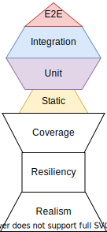

If you have been reading about test driven development in Javascript, chances
are you have come across [Kent C. Dodds](https://kentcdodds.com/), the [Testing Trophy](https://twitter.com/kentcdodds/status/960723172591992832?ref_src=twsrc%5Etfw%7Ctwcamp%5Etweetembed%7Ctwterm%5E960723172591992832&ref_url=https%3A%2F%2Fkentcdodds.com%2Fblog%2Fwrite-tests), and the [Testing Library](https://testing-library.com/). The Testing Trophy and Testing Library have grown significantly over the last couple of years. You may be asking yourself, "Self... Why are these things so great?", and today I hope to answer your inner monologue.

The Testing Trophy is a guide as to what the composition of your testing suite might look like. Each type of testing requires a different amount of effort. Since end-to-end tests requires more effort to set up, it is not viable to write them exclusively while omitting unit and integration tests. But, if you only write unit tests, then you won't have confidence that larger pieces of functionality are working each time you push new code.

This is not an exact prescription to write 50% integration tests, 30% unit tests, and so on. Instead, it suggests that you (and your team) write tests in a way that strikes the best possible balance between **confidence** and **level of effort**. For frontend applications, his suggestion is that integration tests strike the best balance between confidence and speed, so you should spend most of your effort on writing those types of tests.

But, **how** do you achieve confidence with your tests?

If the primary goal of testing is to gain confidence in pushing code without breaking functionality, then our tests need to be written so that they are Realistic, Resilient to changes, and provide adequate Coverage of your code (in that order).

This is the missing piece of the Testing Trophy that I have decided to call **The Confidence Pedestal**. This is what your Testing Trophy rests upon, and without it your confidence will topple over.

| |
|:---:|
| |

| The Confidence Pedestal + The Testing Trophy |
|:---:|
| |
As you can see, Realism and Resiliency are the ultimate foundation for your tests.

If you use snapshot testing you will gain a lot of coverage quite easily. But, as soon as you make a change, even if it does not break the core functionality of the component, the snapshot test will fail. This is not a resilient test, because in this example it triggered a __false negative__.

Conversely, if you made a breaking change to an event handler so that the user was unable to enter text into an input field, the snapshot test would not fail. This is a _false positive_, and it further undermines confidence in your tests.

In addition to not being resilient, these tests are not realistic in that they don't represent how a user would actually use your component.

Now, let's go through an example of what a realistic, resilient test would look like. Take a look at this `ResetPassword` component.

```jsx
// Ongoing work at: https://codesandbox.io/s/beautiful-dubinsky-rwi7s?file=/src/App.js
import React from "react";

const initialState = {
  currentPassword: "",
  newPassword: "",
  retypePassword: "",
  isSubmitted: false,
};

const ResetPassword = () => {
  const [formState, setFormState] = React.useState(initialState);

  const handleChange = ({ target: { name, value } }) => {
    setFormState({
      ...formState,
      [name]: value
    });
  };

  const handleSubmit = () => {
    // Perform validation here.
    setFormState({
      ...formState,
      isSubmitted: true
    })
  }

  return (
    <>
      <div>
        <label htmlFor="currentPassword">Current Password</label>
        <input
          type="password"
          name="currentPassword"
          value={formState["currentPassword"]}
          onChange={handleChange}
        />
      </div>
      <div>
        <label htmlFor="newPassword">New Password</label>
        <input
          type="password"
          name="newPassword"
          value={formState["newPassword"]}
          onChange={handleChange}
        />
      </div>
      <div>
        <label htmlFor="retypePassword">Retype Password</label>
        <input
          type="password"
          name="retypePassword"
          value={formState["retypePassword"]}
          onChange={handleChange}
        />
      </div>
      <button type="submit" onClick={handleSubmit}>Submit</button>
    </>
  );
};

export default ResetPassword;
```

There are three input fields, and a submit button. As a user, we would expect to be able to enter text into these three input fields, and then we can submit the form once we have text in all three fields, plus the two new password fields are matching.

Next time, provide examples of the tests we would write for this. Finish it up by talking about Testing Library, and how it encourages writing Realistic, Resilient tests.

<!-- The Testing Library is a family of packages that help you test UI components in a user-centric way. This aligns with its Guiding Principles,

> ["The more your tests resemble the way your software is used, the more confidence they can give you."](https://testing-library.com/docs/guiding-principles)

For React, there is [React Testing Library](https://testing-library.com/docs/react-testing-library/intro). There are also versions built for [Angular](https://testing-library.com/docs/angular-testing-library/intro), [Vue](https://testing-library.com/docs/vue-testing-library/intro), [React Native](https://testing-library.com/docs/native-testing-library/intro), and more.

All of them are lightweight packages that provide utility functions that encourage better testing practices. Meaning, the methods it provides to query your rendered output for a component mirror how a user would find an element on a page. They also have the added benefit of making your tests much easier to read due to the API design.

For example, say you have a reset password form with a current password input, two new password inputs, and a submit button. Which is a better method to find the current password field, A) to find the input field based on the CSS ID `#currentPassword`, or B) based on a label that says `Current Password`?

If you answered B, then you are correct! Let me explain why. -->
